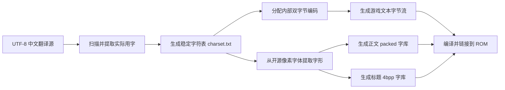

# 《节奏天国》GBA 汉化字库实施方案

## 1. 文档目的

本文档针对 `RTChinese` 项目，说明中文本地化过程中字体、编码、字形资源、排版和构建工具的推荐实现方案。

项目基于 GBA《节奏天国》反编译工程，现有代码包含两套独立文本系统：

1. `text_printer`：正文、说明、菜单及阅读材料等文本。
2. `bitmap_font`：标题、结果画面、动画文字和特殊界面文字。

推荐总体方案：

> 翻译源使用 UTF-8；构建时提取实际用字并生成精简字库；游戏运行时继续使用固定双字节内部编码；正文沿用 `text_printer`，特殊标题单独扩充 `bitmap_font`。

不建议直接塞入完整 GB2312 字库，也不建议在第一阶段把整个游戏运行时文本系统改成 UTF-8。

---

## 2. 项目现有文本系统

### 2.1 正文系统：`text_printer`

关键文件：

- `src/text_printer.c`
- `src/text_printer.h`
- `data/text_printer_data.c`
- `data/text_printer_data.h`
- `bin/text_small_glyphs.bin`
- `bin/text_medium_glyphs.bin`
- `bin/text_large_glyphs.bin`
- `bin/text_small_glyph_sizes.bin`
- `bin/text_medium_glyph_sizes.bin`
- `bin/text_large_glyph_sizes.bin`

主要能力：

- ASCII 和双字节 Shift-JIS 字符解析
- Small、Medium、Large 三种字号
- 比例字宽
- 自动换行
- 左、中、右对齐
- 字体颜色和阴影
- 缩进与格式控制
- 日文标点禁则
- 将紧凑字形绘制到 GBA 4bpp VRAM

现有总字形槽数：

```c
#define TEXT_PRINTER_TOTAL_GLYPHS 0x1CA4
```

即 7332 个 glyph ID。原版字库包含日文假名、标点、拉丁字符和大量日文汉字，但不能视为完整简体中文字库。

### 2.2 特殊字体系统：`bitmap_font`

关键文件：

- `src/bitmap_font.c`
- `src/bitmap_font.h`
- `data/bitmap_font_data.c`
- `data/font_definitions.c`
- `data/font_definitions.h`
- `graphics/font/`

当前支持的主要字符范围：

- Shift-JIS 全角标点
- 全角数字
- 全角拉丁大写和小写
- 平假名
- 片假名

当前没有汉字分支。大量字符串遍历代码默认每个可打印字符占两个字节，例如 `string += 2`，因此不适合直接改用变长 UTF-8 字符串。

字形资源采用标准 GBA 4bpp raw：

| 字体 | 字形尺寸 | 每字形大小 |
|---|---:|---:|
| Outline | 16×16 | 128 字节 |
| Body | 8×16 | 64 字节 |

---

## 3. 推荐总体架构



开发阶段保留易编辑的 UTF-8 中文文本；构建工具负责将中文转换为游戏内部编码，同时生成匹配的字形数据和映射表。

---

## 4. 内部编码设计

### 4.1 为什么不直接在运行时使用 UTF-8

UTF-8 中文字符通常占三个字节，而现有 `bitmap_font` 的多处代码假定每字符固定两个字节。全面支持 UTF-8 需要修改：

- 字符解码器
- 所有字符串遍历代码
- 字符数量计算
- 文本宽度计算
- 自动换行和标点禁则
- OBJ/BG 打印路径
- 动画文字路径
- 控制码解析

这会明显扩大改动面，也容易破坏原有日文文本和格式控制。

### 4.2 推荐：固定双字节私有编码

为翻译中实际使用的每个中文字符分配一个稳定的双字节编号。例如：

```text
节 -> F0 40
奏 -> F0 41
天 -> F0 42
国 -> F0 43
```

实际分配应由工具自动完成，不应手工维护十六进制编号。

编码区间需要避开：

- `0x00` 字符串终止符
- 已有 Shift-JIS 有效区间
- 尾字节 `0x7F`
- C 字符串中容易产生歧义的 `0x5C`
- 项目已有格式控制字节

生成的 C 文本建议使用显式转义：

```c
"\xF0\x40\xF0\x41\xF0\x42\xF0\x43"
```

不要把不可见的内部编码字节直接作为源码文本保存。

### 4.3 字符表必须稳定

建议维护：

```text
generated/charset.txt
generated/charmap.json
```

发布 ROM 后，已有字符编号不得因排序变化而重新分配。新增字符只能追加，或者采用明确的版本迁移流程。否则旧文本、字库和映射表会全部错位。

---

## 5. 精简字库，而不是完整 GB2312

GB2312 包含 6763 个汉字。`text_printer` 当前三套字形记录大小分别为：

| 字号 | 每字形记录 |
|---|---:|
| Small | 24 字节 |
| Medium | 24 字节 |
| Large | 32 字节 |
| 三份宽度表 | 合计 3 字节 |

每增加一个字符，正文三字号合计约为：

$$
24+24+32+3=83\text{ bytes}
$$

完整加入 6763 个字符约为：

$$
6763\times83\approx561\text{ KB}
$$

虽然 ROM 容量可能允许，但会包含大量永远不会出现的字符，也会增加制作、校验和维护成本。

推荐扫描全部翻译文本，只保留实际出现的字符。完整游戏汉化常见独立用字量约为 1500～3000，最终数量以项目文本统计为准。

假设实际使用 2200 个字符，正文三字号约增加：

$$
2200\times83\approx183\text{ KB}
$$

这是更合理的规模。

---

## 6. 字体来源建议

### 6.1 首选：缝合像素字体

项目地址：<https://github.com/TakWolf/fusion-pixel-font>

优点：

- 支持 8px、10px、12px
- 提供简体中文 `zh_hans`
- 有等宽和比例宽度版本
- 原生像素字体，适合低分辨率屏幕
- 字体使用 SIL OFL 1.1
- 构建程序使用 MIT

建议用途：

- Small：8px 或 10px
- Medium：10px 或 12px
- Large：12px 字形放入更大的画布
- Outline：从 12px 字形生成 16×16 描边版本后人工校正

### 6.2 后备：GNU Unifont

项目地址：<https://unifoundry.com/unifont/>

特点：

- 字形通常为 8×16 或 16×16
- Unicode 覆盖广
- 提供 `.hex`、BDF、PCF 和 OpenType
- 适合直接提取点阵
- 可作为缺字后备字体
- 提供 SIL OFL 1.1 / GPL 字体例外授权

缺点是风格偏系统字体，与《节奏天国》的视觉风格不完全一致。

### 6.3 不建议的来源

- 未确认嵌入和再分发许可的系统字体
- 从其他商业游戏 ROM 中提取的字库
- 直接把普通宋体缩放到 8×16

字体加入仓库和 ROM 前，应保存许可证文件及来源说明。

---

## 7. 正文字库生成

### 7.1 现有 `.bin` 不是普通 4bpp

以下文件并非可直接 DMA 到 VRAM 的标准 GBA 4bpp 图块：

- `bin/text_small_glyphs.bin`
- `bin/text_medium_glyphs.bin`
- `bin/text_large_glyphs.bin`

它们是项目专用紧凑字形格式，由 `asm/code_08000a00.s` 中的 ARM 绘制器解析，再输出到 4bpp VRAM。

因此不能简单执行“PNG 转 4bpp 后追加”。

### 7.2 推荐的格式逆向步骤

1. 在现有字库中选择容易辨认的字符，如 `A`、`0`、`あ`。
2. 根据 glyph ID 截取对应的 24 或 32 字节记录。
3. 阅读 `text_print_glyph_to_vram_rom` 汇编实现。
4. 编写解码脚本，将记录还原为单色或多色 PNG。
5. 与模拟器内显示结果进行对照。
6. 确认位序、行高、基线、阴影和左右方向。
7. 实现逆向编码：像素图 → 24/32 字节 packed 记录。
8. 使用少量中文字测试三种字号。

保留现有绘制器的优点：

- 比例字宽继续有效
- 字符不必严格对齐到 tile 边界
- 自动换行和阴影逻辑可继续使用
- 不需要重写性能敏感的 ARM 绘制器

### 7.3 三套字库必须同步

Small、Medium、Large 三套字体必须使用完全相同的 glyph ID 顺序。例如 glyph ID 8000 如果是“节”，三套字体的 8000 都必须是“节”。

宽度表也必须与字形数量一致。

---

## 8. `text_printer` 的代码改造点

### 8.1 字符解码

主要修改：

- `src/text_printer.c` 中的 `text_printer_get_glyph_id()`

需要增加中文内部编码区间的识别，将双字节内部编码转换为 glyph ID。

### 8.2 总字形数量与映射

主要修改：

- `data/text_printer_data.h`
- `data/text_printer_data.c`

可能需要调整：

- `TEXT_PRINTER_TOTAL_GLYPHS`
- lead-byte 基址表
- 中文编码映射表
- 映射值的数据类型

若 glyph ID 可能超过 `0x7FFF`，应检查现有 `s16` 基址是否安全，必要时改为 `s32` 或 `u32`。

### 8.3 保留原有 ASCII 和日文

新增中文编码时，不应破坏：

- ASCII 映射
- 原版 Shift-JIS 假名和汉字
- 格式控制码
- 换行符
- 原版未翻译文本

这样可以分阶段汉化，而不是要求一次替换全部文本。

---

## 9. `bitmap_font` 的扩充方案

### 9.1 只加入特殊界面实际使用的汉字

建议先加入：

```text
节奏天国
开始
继续
结果
成功
失败
练习
完美
设置
返回
```

不要把全部正文中文字复制到 Outline 字库。

### 9.2 资源结构

可以在 `BitmapFontData` 中增加中文字段，示意如下：

```c
const void *cjkTextures;
const u8 *cjkWidths;
u16 cjkCount;
```

涉及文件：

- `src/bitmap_font.h`
- `src/bitmap_font.c`
- `data/font_definitions.h`
- `data/font_definitions.c`

如果中文内部编码连续，可以按 lead/trail 直接计算索引，避免建立大型指针表。

### 9.3 资源文件

建议新增：

```text
graphics/font/warioware_outline_chinese_glyphs.raw.4bpp
graphics/font/warioware_body_chinese_glyphs.raw.4bpp
```

Makefile 会自动处理 `.raw.4bpp` 文件。使用 `rt_modern.ld` 时通常可由通配符收集；使用精确匹配链接脚本 `rt.ld` 时，需要显式加入新增对象。

### 9.4 缺字保护

应准备固定的 `□` 字形。

遇到编码非法、映射不存在或字体缺字时，应返回 `□`，不能继续使用空纹理指针。当前 `bitmap_font` 的部分调用路径未必能安全处理 `NULL`。

---

## 10. VRAM 和运行时限制

完整字库应保存在 ROM 中，显示时只将当前文本所需字形绘制或复制到 VRAM。

该项目现有设计已经部分符合这一原则：

- `text_printer` 将当前文本绘制到 VRAM
- `bitmap_font` 使用字形缓存槽

需要关注：

- GBA OAM 最多 128 个对象
- 16×16 的 4bpp OBJ 字符占 4 个 tile
- `bitmap_font.c` 的 OBJ 字符宽度缓存约为 64 个字符
- `text_printer.c` 的格式化 glyph 缓冲约为 128 个字符
- BG/OBJ VRAM 还要与场景图形和动画资源共享

因此正文应优先使用 `text_printer`，不应将长段中文正文实现为“一字一个 OBJ”。

---

## 11. 中文排版规则

### 11.1 标点禁则

中文化后应补充行首禁用标点：

```text
，。！？：；）】》」』、…
```

行尾禁用标点：

```text
（【《「『
```

相关位置：

- `text_glyph_is_open_bracket()`
- `text_glyph_is_end_punctuation()`
- `data/text_printer_data.c` 中的标点表

### 11.2 建议字宽

| 字号 | 汉字建议宽度 |
|---|---:|
| Small | 8～10 像素 |
| Medium | 10～12 像素 |
| Large | 12～16 像素 |

汉字不宜像英文一样裁得过窄。中文逗号、句号等标点可以使用较窄的比例宽度。

### 11.3 人工换行

虽然正文系统支持自动换行，但教程、节奏提示和结果界面通常对显示时间与版式敏感，建议重点文本仍由人工确认换行位置。

---

## 12. 推荐工具目录

建议新增：

```text
tools/font/
├── extract_charset.py
├── build_charmap.py
├── build_text_font.py
├── build_bitmap_font.py
├── decode_original_font.py
└── validate_text.py
```

建议职责：

### `extract_charset.py`

- 扫描 UTF-8 翻译文件
- 排除格式控制符
- 收集实际使用字符
- 输出新增字符报告

### `build_charmap.py`

- 维护字符到内部双字节编码的稳定映射
- 保留旧编号
- 新字符只追加
- 输出 `charmap.json` 和 C 映射表

### `decode_original_font.py`

- 解码现有 packed 字库
- 输出 PNG 供格式确认
- 用于验证编码器是否与原格式兼容

### `build_text_font.py`

- 从开源字体提取字形
- 生成 Small、Medium、Large packed 数据
- 生成三份宽度表
- 生成缺字字形

### `build_bitmap_font.py`

- 生成 16×16 Outline 4bpp
- 生成 Body 字形
- 输出 `.raw.4bpp` 和宽度表

### `validate_text.py`

- 检测缺字
- 检测非法内部编码
- 检测过宽文本
- 检测字符串控制码错误
- 检测三套字库 glyph 数量不一致

---

## 13. 推荐实施阶段

### 阶段一：最小验证

只加入以下测试文本：

```text
节奏天国中文测试
```

选择一个明确调用 `text_printer` 的场景，验证：

- 内部编码映射正确
- Small、Medium、Large 显示同一个字符
- packed 格式正确
- 字宽与换行正确
- 模拟器中没有花屏
- 真机显示正常

### 阶段二：建立自动构建流水线

完成：

- UTF-8 翻译源
- 字符扫描
- 字符表维护
- 文本转码
- 三字号字体生成
- 缺字和超宽检测

### 阶段三：正文汉化

推荐顺序：

1. 主菜单
2. 选项
3. 结果界面
4. 教程
5. 游戏内提示
6. 咖啡厅和阅读材料
7. Staff Roll

### 阶段四：特殊标题字体

最后处理使用 `bitmap_font` 的标题、动画字和 WarioWare 风格文字。这些字形通常需要人工修图和描边，自动生成只能作为初稿。

---

## 14. 测试清单

每次扩充字库后检查：

- [ ] 所有翻译字符均有映射
- [ ] 所有映射均有三套正文字形
- [ ] 字形数量和宽度表数量一致
- [ ] 缺字显示为 `□`
- [ ] ASCII、日文和控制码未被破坏
- [ ] 中文标点不会出现在错误行首或行尾
- [ ] 长文本不会越过窗口边界
- [ ] OBJ 文本未超过对象和缓存限制
- [ ] BG 文本未覆盖场景图块
- [ ] VBlank 期间资源更新没有明显闪烁
- [ ] mGBA 等模拟器显示正常
- [ ] 至少在一台真实 GBA 或兼容硬件上验证
- [ ] 最终 ROM 未超过链接脚本和卡带容量限制

---

## 15. 参考资料

### GBA 文本渲染

- Tonc Text Systems：<https://www.coranac.com/tonc/text/text.htm>
- Tonc's Text Engine：<https://www.coranac.com/tonc/text/tte.htm>
- GBA 图形硬件概览：<https://gbadev.net/gbadoc/graphics.html>

Tonc 的关键经验：

- 大字库不应全部常驻 VRAM
- 应只加载当前画面需要的 glyph
- 字符编码与 glyph ID 应分离
- 比例字体适合直接渲染到目标 tile 或 bitmap
- 1bpp/紧凑字形可节省 ROM，但必须与渲染器格式一致
- 性能敏感的 tile 字形渲染适合 ARM 汇编和批量位操作

### 开源字体

- 缝合像素字体：<https://github.com/TakWolf/fusion-pixel-font>
- GNU Unifont：<https://unifoundry.com/unifont/>

---

## 16. 最终建议

本项目最稳妥的汉化字库路线是：

1. 翻译文本以 UTF-8 管理。
2. 构建时提取实际使用字符。
3. 为中文字符分配固定双字节内部编码。
4. 正文沿用 `text_printer` 的紧凑 packed 字库和现有 ARM 绘制器。
5. 标题和动画文字单独扩展 `bitmap_font`。
6. 不加入完整 GB2312，只生成项目实际用字。
7. 建立缺字、超宽、控制码和三字号一致性检查。
8. 先完成少量字符的端到端验证，再批量汉化。

该方案改动面较小，兼容现有 Shift-JIS 和格式控制逻辑，也符合 GBA 平台在 ROM、VRAM、OAM 和渲染性能方面的实际限制。
